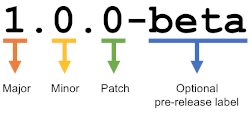
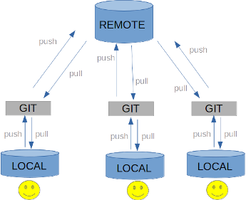

# Git basics

## Plan

* What is versioning

* Git introduction

* Lab: practicing Git

# What is versioning?

* Versioning is the **practice** of tracking and managing changes to software code

* SCM (or VCS) are the tools to achieve it

# What can be versioned?

* Code (or any text-based documents)
* Project versions:
  * Global project version ( tags: 1.2.4-beta )
  * Each modification is a «version»
* Change requests

# Semantic Versioning (tag names)

* MAJOR - when incompatible API changes
* MINOR - when new functionality
* PATCH - when bug fixes
* LABEL - optional, for pre-releases

# Evolution of versioning

* Centralized
  * Needs network
  * Single Point of Failure (SPOF)
* Decentralized
  * Network failure doesn't stop work
  * No SPOF

# Why learn git?

* The most popular VCS
* Decentralized
* Open Source and free
* Created in 2005 by Linus Torvalds

# What is git?

* Is a set of versioned files with the  entire history of changes
* Copied to a local folder “.git” folder at the root of a project
* The users choose the files to version

# Local vs. remote git repository

# Git flow

1. Checking out remote changes
   `git clone` or `git pull`
2. Editing a file
   eg: add a new function “attack()” to the “player.js” file
3. Adding a file to “staging area” for the next commit
   `git add player.js`
4. Commit the modification to the local repository:
   `git commit -m "Add player attack"`
5. Send local modifications to the **remote** repository
   `git push`
6. Resolution of any conflicts:
   Code modification + commit

# Git states

* **Untracked** - new file not yet tracked by git
* **Unchanged** - unchanged since previous commit
* **Changed** - changed since the last commit
* **Staged** - changes selcted for next commit
* **Committed** - changes committed to git history

# Conflicts & conflict resolution

Conflicts happen when multiple users modyify the same line.

Resolved manually:

* edit files with a resolver tool (or text editor)
* commit the files
* push to the **remote branch**

# Branches

*1 branch = 1 separate versioning space -> isolation of changes*

# Managing a git repository

**Git commands**

* `git add`, `git commit`, `git push`, `git pull` , `git merge` ...
* Through a graphical interface: GitHub Desktop, Fork, GitKraken...

**Git remote repositories**

* GitHub, GitLab, self-hosted...

**Ignoring files**

* The “.gitignore” file contains the files to ignore
* Works with wildcards
* .* : ignore all files starting with a “.”
* Useful for ignoring files specific to your environment:
* codeblocks or VScode files

# Go further

* Learn the difference between **merge and rebase**
  * https://dzone.com/articles/merging-vs-rebasing
* Learn **Conventional Commits** - a specification for writing commit messages
  * https://www.conventionalcommits.org/en/v1.0.0-beta.2/
