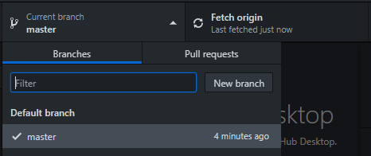
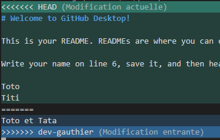
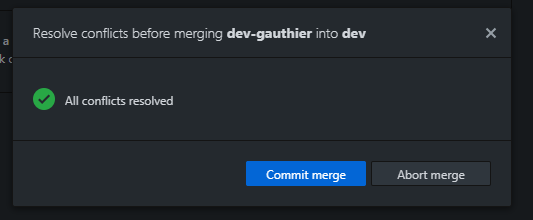

# Git introduction

## Before starting

1. Create a GitHub account: https://github.com/
2. Install an IDE if you don't already have one such as [Sublime text](https://www.sublimetext.com/3) or [Visual Studio Code](https://code.visualstudio.com)

## Objectives

This workshop is executed **in groups of 2-3 people**. At least 2 students must have a machine and a GitHub account.

1. Faire le tutoriel Github Desktop
1. Créer un repository et le cloner sur son ordinateur
1. Créer une branche et naviguer entre les branches
1. Modifier un fichier du repository et pousser les modifications
1. Gérer des conflits

## Tutoriel Github Desktop

Lancer Github Desktop
Lancer le tutoriel et suivre les indications

## Repository creation and clone

Un seul membre du groupe crée un repository :

1. Se connecter à [Github.com](https://github.com)
1. From your home account, navigate to the page **"Your repositories"**
1. Click on the **"New"** button
   1. Choose a project name
   1. Check **"Add a README file"**
   1. Enable `.gitignore` by selecting any template such as `C++`
1. From your project page, go to **"Settings > Manage Access"**, click on **"Invite a collaborator"** and add your project's group memebers.

**Tous les membres** du groupe clonent le repository :

1. Open Github Desktop
1. Click on **"Clone a repository from the Internet"**
1. Provide the name for your project repository
1. Click on "Clone"
1. You know have a local copy of the repository on your machine

## Branch creation

**Un membre** du groupe crée une branche, for example `feat/awesome-feature` :

1. Dans Github Desktop : **Current branch > New branch**
   
1. Choose a branch name, eg `feat/awesome-feature`
1. Click on the **"Create branche"** button

Vous pouvez maintenant naviguer (= checkout) entre les branches `main` et `feat/awesome-feature`.

## Pousser des modifications et récupérer les changements des collaborateurs

**Un membre** du groupe modifie le fichier `README.md` et pousse la branche `feat/awesome-feature` :

1. Modifier le fichier README.md entièrement :
   1. Ouvrir le repository votre IDE
   1. Remplacer tout le contenu du fichier README.md
1. Dans Github Desktop :
   1. Choisissez un message de commit ("Summary")
   1. "Commit to feat/awesome-feature"
   1. Utiliser **"Publish branch"** pour pousser vos changements
   1. Créez **"Pull request"**

**Les autres membres** du groupe récupèrent les changements :

1. Utiliser **"Fetch origin"** pour synchroniser votre repository local avec les changements distants
1. Naviguer vers la branche `feat/awesome-feature` et observer vos fichiers changer dans votre IDE

## Conflict handling

Un conflit arrive lorsqu’une partie d’un fichier a été modifiée sur 2 branches qui doivent fusionner (merge). Nous allons créer un conflit pour voir comment le résoudre.

**2 membres** du groupe crée chacun une branche à partir de `feat/awesome-feature` et modifier la même partie (mêmes lignes) du fichier README.md :

1. Créer une branche dev-prenom "based on... feat/awesome-feature"
1. Modifier le fichier README.md
1. Commiter les changements
1. Pousser ses changements

**Tour à tour**, chaque membre merge sa branche sur `feat/awesome-feature`:

1. Checkout sur la branche `feat/awesome-feature`
1. Cliquer sur **"Choose a branche to merge into feat/awesome-feature"**
1. Sélectionner la branche
1. Pousser vos modifications 
1. Le 2ème membre du groupe va rencontrer un conflit :
   1. Ouvrir votre IDE comme vous le propose Github Desktop
   1. Le conflit se matérialisent comme suit :
      
   1. Pour résoudre le conflit, conserver soit la partie HEAD, soit la partie dev-prenom et supprimer les autres lignes (y compris les lignes "====" et ">>>>")
   1. Une fois les lignes supprimées vous pouvez commiter le merge depuis Github Desktop
      

## Refaire le TP en ligne de commande

Le but est de refaire les mêmes actions que précédemment en ligne de commande.
Pour cela il faut avoir un terminal et GIT installé par défaut sur Linux ou MacOS. 

Pour l’installation :

- Windows : https://gitforwindows.org/
- Linux : https://git-scm.com/download/linux
- MacOS : https://git-scm.com/book/fr/v2/D%C3%A9marrage-rapide-Installation-de-Git

Vous pouvez à présent ouvrir le terminal (sur Linux ou MacOS) ou Git for Windows (sur Windows).

Vous pouvez trouver une liste détaillée des différentes commandes GIT en ligne de commande : 

- https://gist.github.com/aquelito/8596717
- https://github.github.com/training-kit/downloads/fr/github-git-cheat-sheet.pdf
